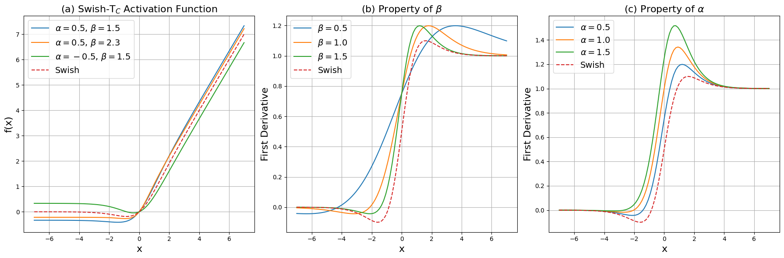

# Swish-T Family Implementation in PyTorch

A PyTorch Implementation of Swish-T family ( Swish-T, Swish-T<strong>A</strong>, Swish-T<strong>B</strong>, Swish-T<strong>C</strong> ).

## Introduction

In this work, we propose the Swish-T family, which enhances the Swish activation function by introducing an adaptive bias concept based on the input value $x$. The Swish-T family consists of the following variants:

- **Swish-T**: This variant incorporates a tanh bias, offering superior performance but generally exhibits slower learning speeds compared to the standard Swish function.
- **Swish-T<strong>A</strong>**: Simplifies the formula for faster learning speeds, making it efficient for applications requiring quick training times.
- **Swish-T<strong>B</strong>**: Reintroduces the $\beta$ parameter, providing better performance metrics by allowing fine-tuning of the activation's shape.

- **Swish-T<strong>C</strong>**: Effectively controls the bias using the $\beta$ parameter, achieving stable performance across different tasks.

## arXiv 

soon

## citation

soon